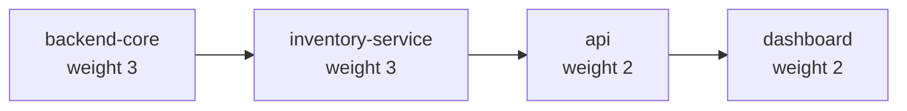
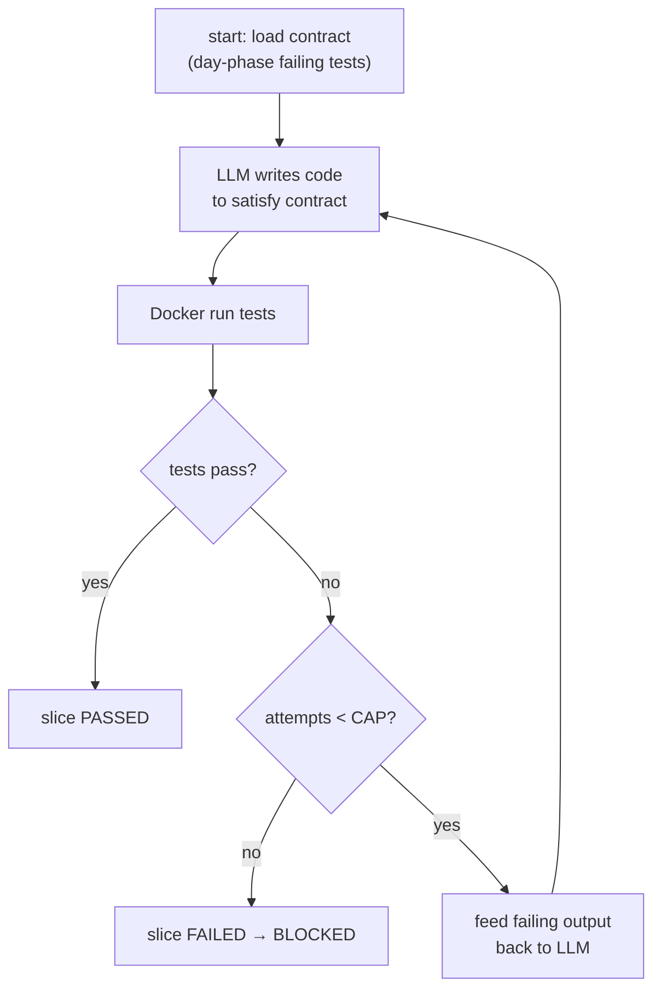

# Dependency DAG — Slice Ordering Design

> Design artifact for the dual-phase multi-agent coding system. Design-level only:
> schema + illustrative snippets, no full implementation.

## 0. Guiding constraints

- **Backend-first critical path (default heuristic).** The backend owns the data model / persistence /
  API contract, so backend-first is the *default* order. This is a priority signal, not a hard
  "must": dev order should never block a better design choice. The DAG makes it the **default**,
  not an unbreakable rule.
- **Cheap-but-slow local LLM (Ollama).** Minimize model calls. Prefer a small,
  deterministic, low-call-count pipeline over chatty multi-agent loops.
- **Night phase = closed per-slice loop.** Write code → Docker-run tests → feed
  failure → retry with a hard cap → else mark **blocked** and refuse to advance.
- **Day phase = TDD spec.** LLM writes *failing tests first*; those tests become
  the contract the night executes against.

---

## 1. DAG model

**Nodes = slices.** A slice is the atomic unit of night-phase work: one test
contract (from the day phase), one LLM write pass, one Docker test run.

**Edges = data/dependency edges.** A directed edge `A → B` means *B cannot start
until A's slice passes its night loop.* Edges encode "B reads what A produces."

### Representation: YAML

YAML is chosen over JSON for human-editability during day-phase review, and over
graph DSLs (Dot) because the DAG needs rich per-node metadata (weights, risk,
phase) that a Dot node can't carry cleanly.

### Schema (concrete)

```yaml
version: 1
# Optional global metadata; not consumed by the sorter.
meta:
  system: inventory-management
  generated_by: day-phase-llm
  generated_at: "2026-10-03"

# The graph. `slices` is the node list; `deps` are directed edges.
slices:
  - id: backend-core
    name: "Persistence layer + domain model"
    phase: backend          # backend | api | frontend
    backend: true           # heuristic ordering hint (see §2)
    weight: 3                 # relative cost/effort (longest-path weight)
    size_sloc: 400
    estimated_complexity: 5
    unknowns: 2
    blast_radius: 5
    contract: contracts/backend-core.yaml   # day-phase failing tests (the spec)
    depends_on: []

  - id: inventory-service
    name: "Inventory service (add/remove/lookup)"
    phase: backend
    backend: true
    weight: 3
    size_sloc: 300
    estimated_complexity: 4
    unknowns: 2
    blast_radius: 3
    contract: contracts/inventory-service.yaml
    depends_on: [backend-core]

  - id: api
    name: "REST API contract"
    phase: api
    backend: true           # api layer is backend-adjacent; ordering hint (see §2)
    weight: 2
    size_sloc: 250
    estimated_complexity: 3
    unknowns: 1
    blast_radius: 3
    contract: contracts/api.yaml
    depends_on: [inventory-service]

  - id: dashboard
    name: "ASCII dashboard"
    phase: frontend
    backend: false          # heuristic ordering hint (see §2)
    weight: 2                 # relative cost/effort (longest-path weight)
    size_sloc: 200
    estimated_complexity: 2
    unknowns: 1
    blast_radius: 1
    contract: contracts/dashboard.yaml
    depends_on: [api]

# Directed edges are implied by `depends_on`. This optional block makes them
# explicit for tooling that reads edges directly.
edges:
  - from: backend-core
    to: inventory-service
  - from: inventory-service
    to: api
  - from: api
    to: dashboard
```

**Node field key:**

| Field | Type | Purpose |
|---|---|---|
| `id` | string | Stable node identity; referenced by `depends_on`. |
| `name` | string | Human label. |
| `phase` | enum | `backend` → `api` → `frontend`; hints tier. |
| `backend` | bool | Heuristic ordering hint (see §2): backend slices get the default-first priority. Not a hard "must" — order can be overridden when a better design choice exists. |
| `weight` | int | Relative cost; used for critical-path length. |
| `size_sloc` | int | Rough size proxy. |
| `estimated_complexity` | 1–5 | Driver for risk score. |
| `unknowns` | 1–5 | Driver for risk score. |
| `blast_radius` | 1–5 | Downstream impact if this slice is wrong. |
| `contract` | path | Day-phase failing-test spec the night runs against. |
| `depends_on` | string[] | Incoming edges. |

---

## 2. Topological sort + backend-first as default order

Kahn's algorithm on in-degree, with a **priority-ordered ready set** that
**defaults** backend slices to be emitted before non-backend slices. This is a
priority signal, not a hard "must": dev order should never block a better
design choice, so the ordering below can be overridden when a better choice
exists.

```
function topo_sort(graph):
    in_deg = {n: len(n.depends_on) for n in graph}
    # only count edges whose source exists (guard dangling refs)
    ready = [n for n in graph if in_deg[n] == 0]

    # Default order: backend-first priority signal (see §2).
    # A backend node is only "blocked" by another backend node.
    # A non-backend node waits for its deps, but may run as soon as its deps
    # are ready even if backend nodes remain elsewhere.
    def sort_key(n):
        return (0 if n.backend else 1, n.phase_rank(n))

    order = []
    while ready:
        # Pop the highest-priority ready node: backend before non-backend.
        ready.sort(key=sort_key)
        n = ready.pop(0)
        order.append(n)
        for m in graph.successors(n):
            in_deg[m] -= 1
            if in_deg[m] == 0:
                ready.append(m)

    if len(order) != len(graph):
        raise CycleError("dependency graph contains a cycle")
    return order
```

**How backend-first is applied as the default order (not just stated):**

1. `sort_key` returns `(0, …)` for backend nodes and `(1, …)` for others, so the
   ready-set *defaults* to dequeueing a backend node first when both are available.
2. `backend` is a hint over the string `phase`; a mislabeled `phase` alone cannot
   reorder, but the whole ordering is a heuristic that can be overridden.
3. **Cross-tier gating:** a non-backend node enters `ready` only after *all* its
   declared `depends_on` are emitted — so no frontend slice is emitted before
   the backend slices it depends on.
4. **Validator:** reject any edge `frontend/backend → backend` (a backend slice
   depending on a non-backend slice). Backend is normally a *source-side* tier,
   though a design that legitimately needs a different order can override.

```
function validate_backend_first(graph):
    for e in graph.edges:
        if graph[e.to].backend and not graph[e.from].backend:
            reject(f"{e.to} is backend but depends on non-backend {e.from}")
```

---

## 3. Critical-path / parallelizable detection

Compute in a single Kahn pass, which yields **levels** (parallel groups) *and*
the critical path simultaneously.

### In-degree / ready-set / levels (Kahn)

- **In-degree** = number of unmet dependencies.
- **Ready-set** = nodes with in-degree 0 (drains as their dependents complete).
- **Level (layer)** = the Kahn "wave." All nodes emitted in the same wave have
  their deps satisfied by prior waves → **they are parallelizable**.

```
function levels(graph):
    in_deg, ready = init(graph)
    current = [n for n in graph if in_deg[n] == 0]
    layers = []
    while current:
        layers.append(current)              # ← all these run concurrently
        nxt = []
        for n in current:
            for m in successors(n):
                in_deg[m] -= 1
                if in_deg[m] == 0: nxt.append(m)
        current = nxt
    return layers                            # layer 0 = can start immediately
```

### Critical path (longest path by weight)

Critical path = the dependency chain whose summed `weight` is maximal; it bounds
the minimum wall-clock time even with infinite parallelism.

```
function critical_path(graph):
    # process nodes in reverse-topo order
    dist = {n: n.weight for n in graph}     # longest path ending at n
    pred = {n: None for n in graph}
    for n in topo_order(graph):             # forward; deps already finalized
        for m in successors(n):
            if dist[n] + m.weight > dist[m]:
                dist[m] = dist[n] + m.weight
                pred[m] = n
    # end = node with max dist; walk pred back to root
    return unwind_pred(end_of_max_dist)
```

**Parallel vs. serialized rule:** two slices can run concurrently *iff* neither is
an ancestor of the other (no path connects them). Slices on the same Kahn level
are always parallelizable. Slices on the critical path are the *serialization*
bottleneck.

---

## 4. Risk / size scoring

High-risk slices are surfaced for **human review during the day phase**, before
the spec is locked.

### Risk model

```
risk = round( (complexity + unknowns + blast_radius) / 3 * weight, 2 )
```

- `complexity`, `unknowns`, `blast_radius` ∈ [1, 5] (LLM-assigned in day phase).
- `weight` scales risk by effort — a big, uncertain, wide-impact slice is worst.

### Size model

```
size_bucket = "s" if sloc < 150 else "m" if sloc < 350 else "l"
```

### Review threshold

```
review_required = risk >= REVIEW_THRESHOLD        # default 4.0
              OR size_bucket == "l"
              OR unknowns >= 4
```

Flagged slices get a human sign-off gate in the day phase; the night loop refuses
to run a flagged slice's contract without an approved marker.

| risk | meaning |
|---|---|
| < 2.0 | trivial, auto-approve |
| 2.0–3.9 | normal pipeline |
| ≥ 4.0 | **flag for human review** |

---

## 5. Worked example — inventory management system

### Slices

| id | phase | backend | depends_on | weight | risk |
|---|---|---|---|---|---|
| `backend-core` | backend | ✅ | — | 3 | 3.0 |
| `inventory-service` | backend | ✅ | `backend-core` | 3 | 3.0 |
| `api` | api | ✅ | `inventory-service` | 2 | 2.0 |
| `dashboard` | frontend | ❌ | `api` | 2 | 1.5 |

### DAG



### Topological order (default backend-first)

`backend-core → inventory-service → api → dashboard`

The chain is linear, so the order is fully determined; the default backend-first
signal is trivially satisfied but the validator still rejects any back-edge.

### Kahn levels (parallelism)

| Level | Slices | Parallel? |
|---|---|---|
| 0 | `backend-core` | single source |
| 1 | `inventory-service` | single |
| 2 | `api` | single |
| 3 | `dashboard` | single |

This example is fully serialized. A *parallel* variant adds an orthogonal slice:

| Level | Slices | Parallel? |
|---|---|---|
| 0 | `backend-core` | — |
| 1 | `inventory-service`, `seed-data` | ✅ concurrent (both depend only on `backend-core`) |
| 2 | `api` | — |
| 3 | `dashboard` | — |

### Critical path

`backend-core (3) → inventory-service (3) → api (2) → dashboard (2)` = **weight 10**.

Any added slice not on this chain (e.g., `seed-data`) is parallelizable slack and
does not extend the critical path.

### Risk flags (day phase)

With defaults, this system's slices are all < 4.0 → no forced review. Bumping
`unknowns` on `inventory-service` to 5 pushes its risk to `3.33`; a `blast_radius`
of 5 on `backend-core` yields `4.0` → **flagged for human review** before locking.

---

## 6. Integration with the night loop

The DAG drives execution **slice by slice** in topological order. A slice only
enters the night loop once *all* its `depends_on` have a `passed` status.

### Slice statuses

`pending → ready → running → passed | failed | blocked`

- **passed** — night loop satisfied the contract. Dependents may proceed.
- **failed** — hard cap exhausted. Slice is **blocked**; run refuses to advance.
- **blocked** — terminal; dependents are skipped and surfaced for morning review.

### Scheduler (DAG → loop)

```
function run_dag(graph, order):
    statuses = {n: "pending" for n in graph}
    for n in order:                      # topological order guarantees deps done
        if any(statuses[d] != "passed" for d in n.depends_on):
            statuses[n] = "blocked"     # dep failed/blocked → skip + propagate
            surface_for_morning(n, reason="dependency blocked")
            continue
        if n.flagged_for_review and not human_approved(n):
            statuses[n] = "blocked"
            continue
        statuses[n] = night_loop(n)     # see below
    if any(s == "failed" for s in statuses.values()):
        raise RunRefused("blocked slice halts the run; re-evaluate in morning")
```

### Night loop (deterministic, closed, per slice)



```
function night_loop(slice, CAP = 3):
    attempts = 0
    while attempts < CAP:
        code = llm_write(slice.contract)        # 1 model call
        write(code)
        result = docker_run_tests(slice.contract)
        if result.passed: return "passed"
        attempts += 1
    return "failed"                             # → BLOCKED
```

**Call-count discipline:** each slice costs ≤ `CAP` LLM calls (3 by default),
and the *whole run* makes a bounded number of calls proportional to
`(#slices × CAP)` — no open-ended conversational loops. Blocked slices short
circuit their dependents, collapsing the remaining call budget.

### Blocked-slice handling

1. Mark slice `failed` → `blocked`.
2. Every transitive dependent is marked `blocked` (skip) — no wasted calls.
3. Run **refuses to advance**; surfaces the blocked chain for morning review.
4. Morning (day phase) re-opens the blocked slice + its dependents for re-scoping;
   the DAG is re-sorted and the run resumes from the unblocked frontier.
